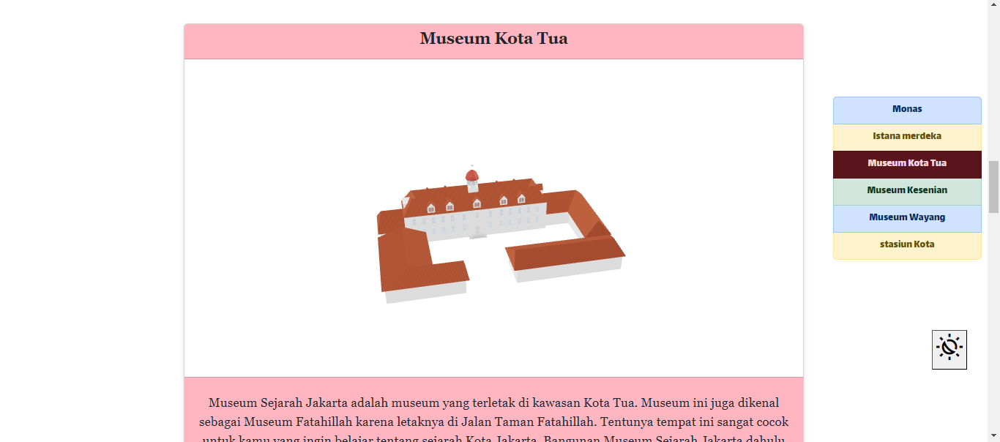

# ICT XU5

### Ringkasan

Website ini merupakan website hasil dari perlombaan dalam ajang ICT perkelas yang diselenggarakan oleh SMA PLUS PGRI CIBINONG yang pesertanya diikuti oleh seluruh kelas 10 saja.

Website ini berisi konten tentang kebudayaan dan sejarah yang ada di kota jakarta. 
selain itu website ini yang membuatnya cukup bagus adalah adanya konten yang berisi model 3D yang berbentuk bangunan bersejarah di jakarta. sehingga kami memenangkan lomba tersebut 

## Tampilan Awal

## Tampilan beranda

## Tampilan konten biasa

## Tampilan konten dengan 3D

## Fitur-fitur website
- tampilan masuk yang menarik
- konten seputar kebudayaan jakarta
- konten seputar sejarah jakarta 
- model 3D bangunan bersejarah di jakarta beserta penjelasannya
- mode gelap & terang

## Tech

- [HTMl] - sebagai kerangka website
- [PHP] - digunakan untuk menyambung halaman lainnya tanpa ketinggalan elemen awal di halaman sebelumnya
- [CSS] - memperindah dan mengatur tampilan website
- [Bootstrap] - libarry untuk membuat elemen yang baru dan menarik
- [Javascript] - membuat website lebih responsif dan lebih menarik 
- [ModelViewer] - libarry  untuk menampilkan model 3D yang ada di website
- [AOS] - libarry yang membuat efek mengalir  ketika elemen baru muncul di layar
- [Xampp] -  sebagai server untuk menjalankan website ini

[HTML]: <https://developer.mozilla.org/en-US/docs/Web/HTML>
[CSS]: <https://developer.mozilla.org/en-US/docs/Learn/CSS/First_steps/What_is_CSS>
[Javascript]: <https://developer.mozilla.org/en-US/docs/Web/JavaScript>
[PHP]:  <https://www.php.net/>
[Bootstrap]:  <https://getbootstrap.com/>
[ModelViewer]: <https://modelviewer.dev/>
[AOS]: <https://michalsnik.github.io/aos/>
[Xampp] - <https://www.apachefriends.org/download.html>

 

